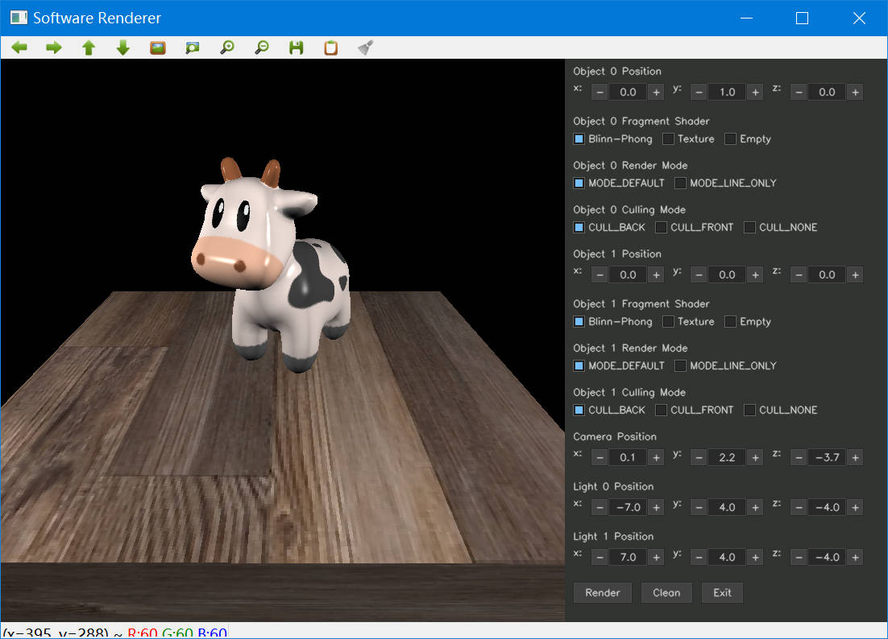

# CG_Basic

软渲染器，手搓了除UI、数学库、模型文件解析以外的全部内容（光照Shader偷了一点games101的内容），所以代码很脏很丑。基本包括：

- 管线基础内容

- GUI调参和键鼠移动摄像机和方向（Thanks to [cvui](https://github.com/Dovyski/cvui)）
- obj和mtl加载（Thanks to [OBJ-Loader](https://github.com/Bly7/OBJ-Loader)）
- 光照开关、材质开关、画线模式
- 多点光源光照
- 背部剔除
- 视锥体剔除
- 各种插值和矫正
- 快速光栅化算法和画线算法

### 编译

依赖OpenCV、Eigen3，使用vcpkg安装并配置变量并使用MSVC编译，需要开release或relwithdebinfo否则会很卡

### 预览

